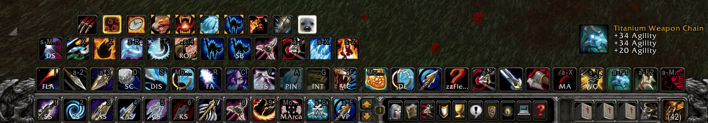
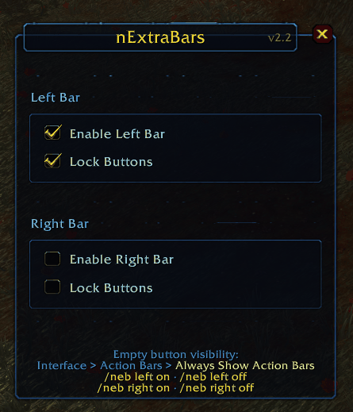
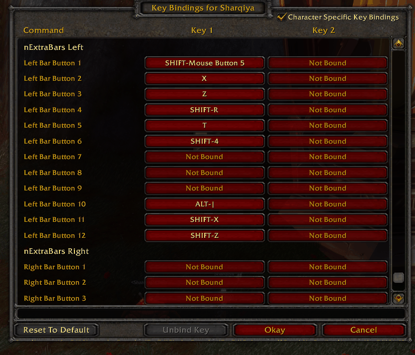
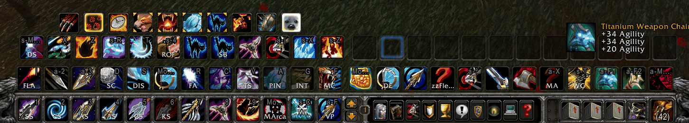

*[Read in English](README.md)*

# nExtraBars

Addon para **World of Warcraft 3.3.5a (WotLK)** que agrega **dos barras de acción extra** (izquierda y derecha), movibles y configurables, con soporte de offset para la barra de clase.

**Versión:** 2.2.2 · **Autor:** Nidhaus

## Qué hace

- Dos barras de acción adicionales, **Left** y **Right**, independientes de las de Blizzard.
- **Movibles**: arrastrás cada barra a donde quieras y la posición se guarda.
- Soporte de **offset para la barra de clase** (stance/shapeshift), para que no se pisen.
- Keybindings propios a través de `Bindings.xml`, configurables desde el menú estándar del juego.
- Configuración **por personaje** (`SavedVariablesPerCharacter: NEB_DB`), así cada alt tiene su propio layout.

## Capturas

Las dos barras extra en su lugar, encima de las barras de acción normales:

El panel de opciones (`/neb`): activá cada barra por separado y bloqueá sus botones:

Cada botón tiene su propio bindeo, listado como *nExtraBars Left* y *nExtraBars Right* en el menú de atajos del juego:

Los slots vacíos están ocultos por defecto. Para verlos mientras acomodás las barras, activá
*Interfaz > Barras de acción > Mostrar siempre las barras de acción*:

## Instalación

1. Cerrá el juego.
2. Copiá la carpeta `nExtraBars` dentro de `World of Warcraft\Interface\AddOns\`.
3. Iniciá el juego y activá el addon en el selector de la pantalla de personajes.

Si venías de una versión anterior, tus ajustes guardados se mantienen.

## Comandos

| Comando | Qué hace |
|---|---|
| `/neb` | Abre el panel de opciones |
| `/nextrabars` | Alias largo |
| `/neb left on` · `/neb left off` | Prende o apaga la barra izquierda |
| `/neb right on` · `/neb right off` | Prende o apaga la barra derecha |
| `/neb reset` | Recarga la interfaz |

## Novedades de la 2.2.2

Release de corrección centrada en la **barra de mascota y los efectos de control**:

- Arreglada la desincronización de la pet bar cuando la mascota recibe Fear, Polymorph, Hibernate o cualquier CC.
- Arreglado el bug que aparecía cuando el **jugador** perdía el control (Fear, Stun) y bugeaba la barra de la mascota.
- Arreglado el caso en que **jugador y mascota** reciben CC simultáneamente.

Técnicamente, se sumaron los eventos `PET_BAR_UPDATE`, `PET_BAR_UPDATE_COOLDOWN`, `UNIT_PET`, `PLAYER_CONTROL_LOST`, `PLAYER_CONTROL_GAINED` y `UNIT_AURA` al sistema de botones, de forma que la actualización se dispara incluso en combate para todo lo que no requiere cambios protegidos.

El historial completo está en [`CHANGELOG.txt`](CHANGELOG.txt).

## Compatibilidad

Interface 30300 — WotLK 3.3.5a. Probado en Warmane.

## Licencia

Uso libre. Si lo redistribuís o lo usás como base, mantené el crédito al autor.
